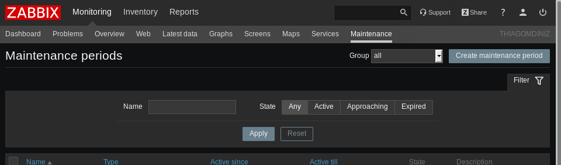

# zabbix4-maintenance-allusers

With the changes applied to the PHP scripts in this project, any Zabbix user will have access to the maintenance menu and can create maintenance periods for the hosts and groups of hosts in which they have access.

## How to use

Overwrite with the scripts in this project the frontend PHP scripts from your Zabbix installation (make a backup of the original scripts).

Example: if your frontend is located in /var/www/html/zabbix:

/var/www/html/zabbix/maintenance.php
/var/www/html/zabbix/include/menu.inc.php
/var/www/html/zabbix/include/views/configuration.maintenance.edit.php
/var/www/html/zabbix/include/classes/api/services/CMaintenance.php

## Final Result

The maintenance submenu is now available in the monitoring menu.

